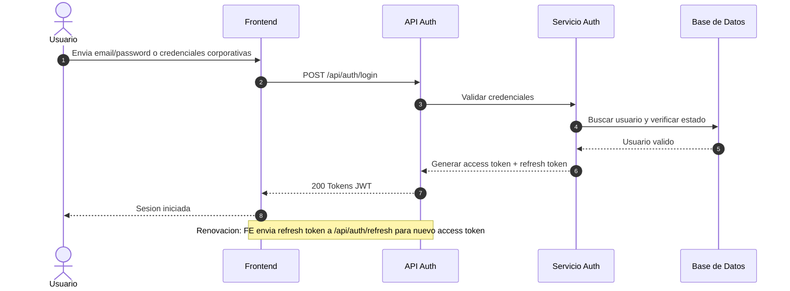
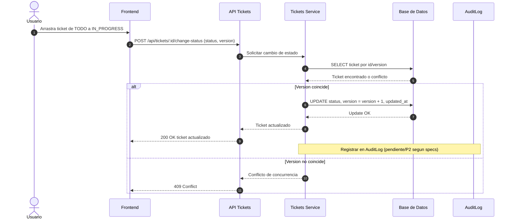
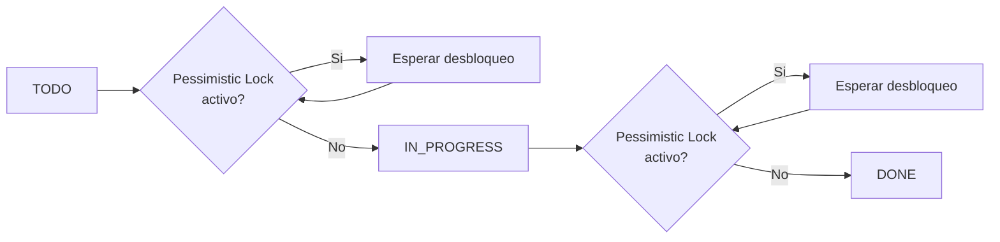

# Diagramas Tecnicos Mini Jira

## 1) Flujo de autenticacion JWT

## 2) Mover ticket entre columnas

## 3) Ciclo de vida de ticket con lock pesimista

## Notas de trazabilidad
- El flujo de concurrencia por version se basa en [BACKEND-SPECS.md](BACKEND-SPECS.md) y [specs.md](specs.md).
- La referencia de rutas para login y cambio de estado se basa en [backend/src/routes/auth.routes.ts](backend/src/routes/auth.routes.ts) y [backend/src/routes/tickets.routes.ts](backend/src/routes/tickets.routes.ts).
- AuditLog se representa como pendiente/P2 porque en [specs.md](specs.md) aparece como out-of-scope en v1.
