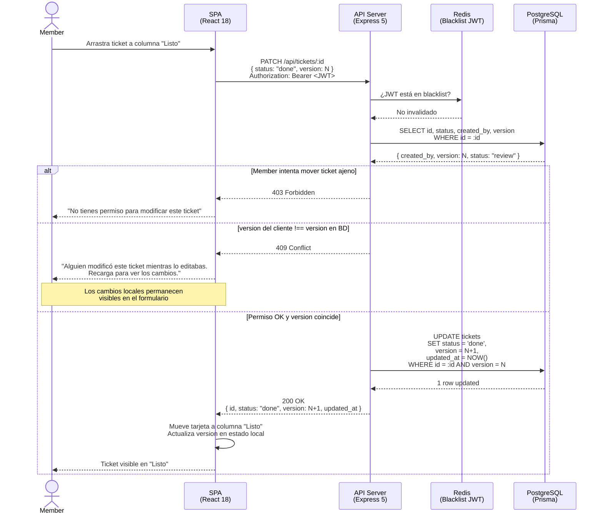

# Diagrama de Secuencia — Mover Ticket de To-Do a Done

---

## Decisiones de diseño

| Paso | Origen en specs |
|---|---|
| Verificación de blacklist en Redis | `specs.md §5` — Redis invalida JWT en logout |
| `SELECT` antes del `UPDATE` | Necesario para validar `created_by` (permisos) y `version` (Optimistic Locking) |
| `AND version = N` en el `UPDATE` | Garantía atómica: evita race condition entre el SELECT y el UPDATE |
| 409 con cambios locales visibles | `specs.md §4` — _"los cambios locales no se pierden"_ |
| 403 para ticket ajeno | `specs.md §2.1` — matriz de permisos: `member` no puede editar ticket ajeno |
